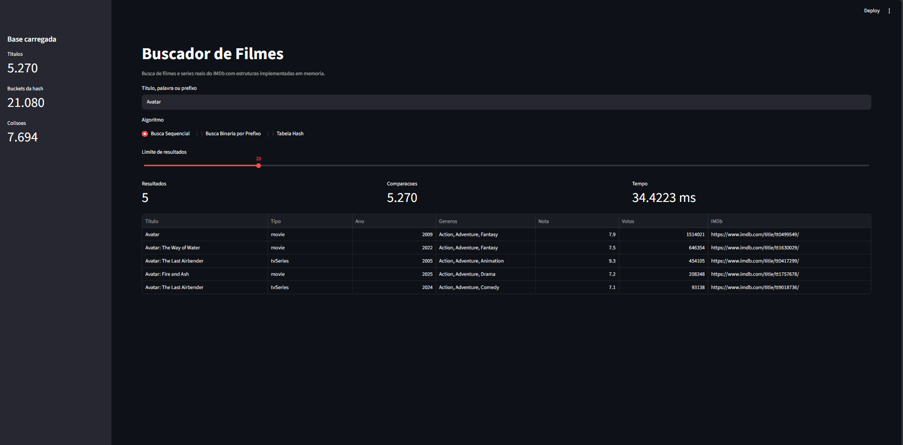
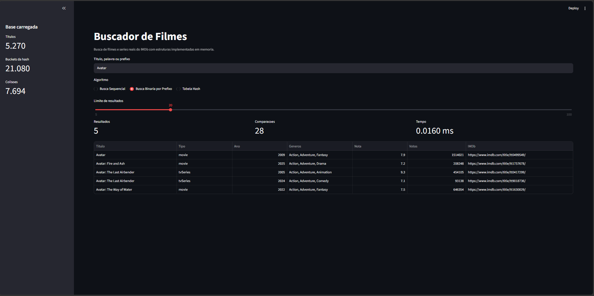
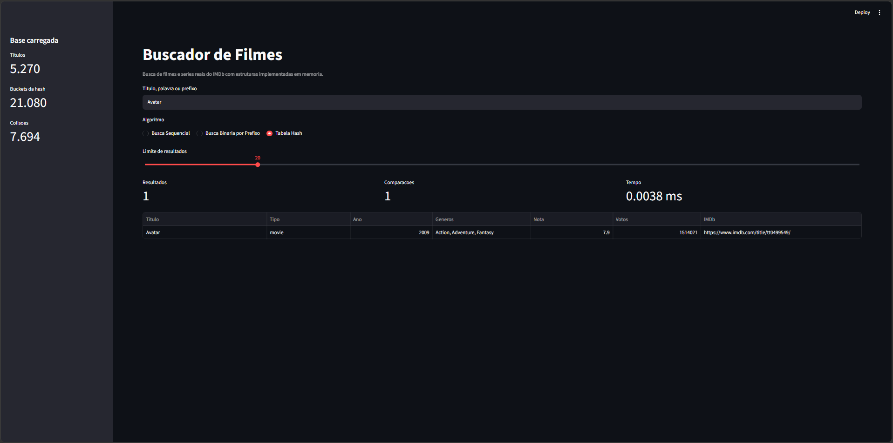

# Buscador de Filmes

Número da Lista: Grupo 38<br>
Conteúdo da Disciplina: Algoritmos de Busca<br>

## Aluno

| Matrícula | Aluno | GitHub |
| -- | -- | -- |
| 221007985 | Diassis Bezerra Nascimento | [@diaxiz](https://github.com/diaxiz) |

## Sobre

O Buscador de Filmes implementa uma busca de títulos do IMDb usando dados reais obtidos dos datasets públicos não comerciais disponibilizados pelo próprio IMDb. A aplicação permite pesquisar filmes e séries por título, palavra ou prefixo usando diferentes estratégias de busca em memória.

O objetivo principal é mostrar como a escolha da estrutura de dados muda o custo da consulta. Para isso, o mesmo termo pesquisado pode ser executado por três abordagens:

- **Busca Sequencial**: percorre a lista completa até encontrar ocorrências compatíveis.
- **Busca Binária por Prefixo**: usa uma lista ordenada por chaves normalizadas do título e duas buscas binárias para encontrar o intervalo de títulos que começam com o termo informado.
- **Tabela Hash Manual**: indexa chaves normalizadas do título em buckets com encadeamento separado, permitindo busca média em tempo constante.

A interface também exibe métricas de execução, como tempo gasto, número de comparações e quantidade de resultados encontrados.

## Fonte dos Dados

Os dados são gerados localmente a partir dos arquivos oficiais:

- `title.basics.tsv.gz`: informações básicas dos títulos.
- `title.ratings.tsv.gz`: nota média e quantidade de votos.

Fonte: [IMDb Non-Commercial Datasets](https://developer.imdb.com/non-commercial-datasets/).

O IMDb permite uso não comercial limitado dos datasets, com atribuição à fonte. Para este trabalho:

Information courtesy of IMDb (https://www.imdb.com). Used with permission.

## Algoritmos Implementados

| Algoritmo | Uso no projeto | Complexidade |
| -- | -- | -- |
| Busca Sequencial | Busca por título percorrendo todos os registros | O(n) |
| Busca Binária | Localização do intervalo de títulos com o mesmo prefixo | O(log n + k) |
| Tabela Hash | Busca exata por título normalizado | O(1) médio |

Onde `n` é o total de títulos carregados e `k` é a quantidade de resultados retornados.

## Screenshots

### Busca Sequencial



### Busca Binária por Prefixo



### Tabela Hash



## Estrutura do Projeto

```text
G38_Busca_EDA2-2026.2/
├── app.py
├── requirements.txt
├── scripts/
│   └── build_dataset.py
├── src/
│   └── imdb_search/
│       ├── algorithms.py
│       ├── dataset.py
│       ├── models.py
│       ├── normalization.py
│       └── search_engine.py
└── tests/
    └── test_search_algorithms.py
```

## Instalação

Linguagem: Python<br>
Interface: Streamlit<br>

Pré-requisitos:

- Python 3.10 ou superior.
- Conexão com a internet para gerar a base IMDb na primeira execução.

Crie e ative um ambiente virtual:

```bash
python -m venv .venv
```

No Windows PowerShell:

```bash
.venv\Scripts\Activate.ps1
```

No Linux/macOS:

```bash
source .venv/bin/activate
```

Instale as dependências:

```bash
pip install -r requirements.txt
```

No Windows, se `python` não estiver disponível, use `py`:

```bash
py -m venv .venv
py -m pip install -r requirements.txt
```

## Preparação da Base

Gere o arquivo processado usado pela aplicação:

```bash
python scripts/build_dataset.py --limit 50000
```

Ou no Windows:

```bash
py scripts/build_dataset.py --limit 50000
```

O script baixa os arquivos do IMDb, filtra títulos do tipo `movie` e `tvSeries`, junta as notas e salva:

```text
data/imdb_titles.csv
```

O parâmetro `--limit` controla quantos títulos serão mantidos na base final, priorizando títulos com maior número de votos. Para uma demonstração mais leve, use `--limit 10000`.

## Uso

Execute a interface:

```bash
streamlit run app.py
```

Ou:

```bash
py -m streamlit run app.py
```

Na interface, digite um título ou prefixo e escolha o algoritmo:

- **Sequencial**: percorre a base inteira e serve como referência simples de funcionamento.
- **Binária por prefixo**: útil para buscas como `bat`, `star`, `matrix`.
- **Hash exata**: útil para consultar títulos completos ou chaves normalizadas com acesso direto.

## Testes

Execute:

```bash
pytest
```

Ou:

```bash
py -m pytest
```

## Observações

- A tabela hash foi implementada manualmente, sem usar `dict` como estrutura principal de armazenamento.
- A busca binária trabalha sobre uma lista ordenada por título normalizado.
- A busca sequencial funciona como linha de base para demonstrar o ganho das estruturas indexadas.
- O dataset completo do IMDb é grande; por isso o projeto gera uma base processada menor e adequada para demonstração acadêmica.

## Vídeo

[Link para o vídeo de apresentação](https://youtu.be/QJ3XJ50krck)
